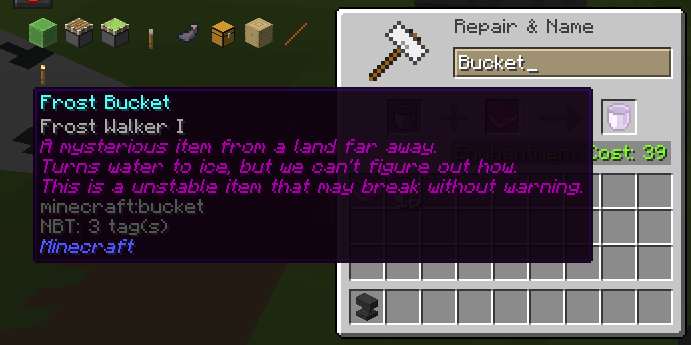

# FrostBucket 

FrostBucket is a server-side Minecraft plugin that adds a new item, the `Frost Bucket`. This item turns water into ice. The FrostBucket plugin does not have any intentional practical use, but just exists to satisfy a concept brought up on a late-night Discord call a few months ago: *"What if you could put Frost Walker on a bucket?"*

## Technical details

The FrostBucket plugin hooks into the Anvil UI, and looks for a combination of a bucket and a Frost Walker enchanted book (Level 1 or 2). If this case is found, the server overrides the cost and output item to produce a *Frost Bucket*.

The *Frost Bucket* is not actually a new item, but a `minecraft:bucket` with some custom NBT (glint, durability, name, lore, ...). The server checks for a player holding this custom item, and overrides the client right-click handler to either pick up water, or place ice.

## Screenshots

